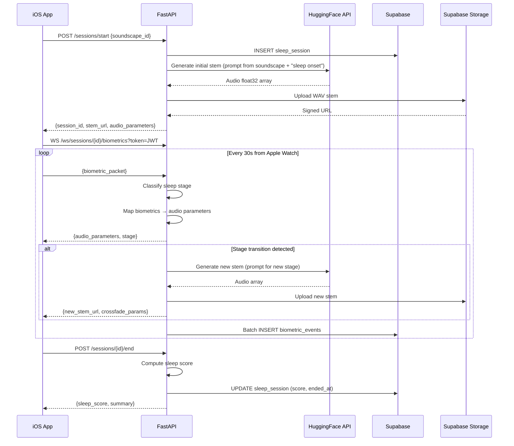

# feat: FastAPI Backend with AI Music Engine

## Overview

Build a self-contained FastAPI backend in `backend/` that serves as the brain of Sleepie: authenticating users via Supabase JWTs, ingesting real-time biometrics over WebSocket, classifying sleep stages, generating adaptive AI music stems via HuggingFace MusicGen, computing sleep scores server-side, and serving analytics. The hybrid audio architecture has the server generate compositional stems while clients handle real-time micro-adjustments for low-latency biometric responsiveness.

## Problem Frame

The iOS app currently runs all audio generation on-device with 8 hardcoded noise presets and talks directly to Supabase. This blocks three strategic goals: (1) AI-driven adaptive music that evolves compositionally with sleep stages, (2) multi-platform expansion to Alexa, Android, and web, and (3) server-side intelligence for scoring, analytics, and future features. (see origin: `docs/brainstorms/2026-04-16-backend-ai-music-engine-requirements.md`)

## Requirements Trace

- R1. iOS app authenticates and performs all data operations through the backend API, never directly to Supabase
- R2. AI music generation via HuggingFace Inference API (MusicGen) produces adaptive stems based on biometric input and sleep stage
- R3. Hybrid audio: server generates base stems, client plays and micro-adjusts in real-time
- R4. WebSocket endpoint ingests biometric packets and pushes stem adaptation events back to the client
- R5. Sleep stage classification runs server-side (port existing heuristic)
- R6. Sleep score computation runs server-side
- R7. Soundscape catalog API serves the 8 presets plus AI-generated options
- R8. Swagger/OpenAPI docs auto-generated
- R9. Dockerized, stateless, horizontally scalable
- R10. Deploys on free tier (Railway/Render + HuggingFace Inference API)
- R11. User profile CRUD synced from Supabase Auth
- R12. Analytics endpoints (sleep trends, averages, session history)

## Scope Boundaries

- Backend does NOT replace the client-side audio engine — clients still synthesize/play audio locally
- Backend does NOT do real-time PCM audio streaming — it serves stem files/URLs
- No custom ML model training — use off-the-shelf HuggingFace models
- No Alexa Skill, web dashboard, or Android app in this plan
- No payment/subscription system
- No push notifications

### Deferred to Separate Tasks

- Alexa Skill integration: future phase after API is stable
- Web dashboard: separate frontend project consuming this API
- Custom AI model training: future iteration when usage data exists
- Redis pub/sub for multi-instance WebSocket coordination: add when scaling past single instance

## Context & Research

### Relevant Code and Patterns

- `SlipieCoreKit/Sources/SlipieCoreKit/Networking/SlipieSupabaseClient.swift` — current Supabase operations to replicate (signIn, signOut, saveSleepSession, fetchSleepSessions, saveBiometricEvents)
- `SlipieCoreKit/Sources/SlipieCoreKit/SleepTracking/SleepStageClassifier.swift` — heuristic algorithm to port (motion > 0.4 = awake, time < 10m = light, HR < 55 + HRV > 50 + time > 30m = deep/REM via 90-min cycle, HR < 65 = light, else awake)
- `SlipieCoreKit/Sources/SlipieCoreKit/AudioEngine/ParameterMapper.swift` — biometric-to-audio parameter mapping algorithm to port
- Database tables: `sleep_sessions` (id, user_id, started_at, ended_at, sleep_score, soundscape_used) and `biometric_events` (id, session_id, recorded_at, hr, hrv, spo2, respiratory_rate, motion_intensity)
- Supabase Auth JWT expiry: 3600s, refresh token rotation enabled

### External References

- FastAPI domain-driven structure: organize by feature domain (auth/, sessions/, audio/, analytics/), not by file type
- Supabase JWKS endpoint: `https://{project}.supabase.co/auth/v1/.well-known/jwks.json` — cache for 10 minutes, use RS256 validation
- HuggingFace MusicGen (`facebook/musicgen-small`): 300M params, text prompt input, returns float32 audio array at 32kHz sample rate
- WebSocket auth: verify JWT in query params before `accept()`, use heartbeat every 30s
- Horizontal scaling: stateless services, async connection pooling via SQLAlchemy `QueuePool`, Gunicorn + Uvicorn workers

## Key Technical Decisions

- **Domain-driven structure**: Each feature domain (auth, sessions, audio, analytics) owns its routes, schemas, service, and exceptions — keeps the monolith clean as it grows
- **Supabase as database, not ORM**: Use `supabase-py` client library to talk to Supabase PostgREST API rather than raw SQLAlchemy — matches the existing iOS client pattern and avoids managing migrations separately
- **JWKS JWT validation**: Validate Supabase JWTs via the JWKS endpoint (RS256) with 10-minute cache, not the legacy JWT secret approach
- **MusicGen via HuggingFace Inference API**: Call the hosted API rather than running the model locally — zero GPU cost, swap for self-hosted or SageMaker later behind the same abstraction
- **Audio stem storage**: Store generated WAV files in Supabase Storage (free 1GB) — the backend generates, uploads, and returns signed URLs to clients
- **WebSocket per-session**: One WebSocket connection per active sleep session, authenticated at handshake, carries bidirectional biometric ingestion and stem adaptation events
- **Pydantic v2 for all schemas**: Strict validation, automatic OpenAPI generation, snake_case internally with camelCase aliases for iOS client compatibility

## Open Questions

### Resolved During Planning

- **Which MusicGen model?** Use `facebook/musicgen-small` (300M params, 12s clips) — fast enough for free tier inference, quality sufficient for MVP
- **Audio format for stems?** WAV at 32kHz (native MusicGen output) — convert to AAC on-the-fly for mobile delivery if bandwidth is a concern later
- **How many stems per cycle?** Start with 1 stem per adaptation (simpler), evolve to layered stems in future iteration
- **Storage for audio files?** Supabase Storage free tier (1GB) — sufficient for MVP, migrate to S3 when needed

### Deferred to Implementation

- Exact MusicGen prompt engineering for each soundscape mood (will iterate based on audio quality)
- WebSocket reconnection strategy on the iOS side (client concern)
- Rate limiting thresholds for AI generation endpoints (tune based on HuggingFace free tier limits)
- Exact sleep score formula beyond the basic heuristic (may evolve with real data)

## Output Structure

```
backend/
├── app/
│   ├── __init__.py
│   ├── main.py                    # FastAPI app factory, middleware, router mounting
│   ├── config.py                  # Settings via pydantic-settings (env vars)
│   ├── dependencies.py            # Shared deps (Supabase client, current user)
│   ├── auth/
│   │   ├── __init__.py
│   │   ├── routes.py              # POST /auth/signin, /auth/signout, GET /auth/me
│   │   ├── schemas.py             # SignInRequest, SignInResponse, UserProfile
│   │   ├── service.py             # Supabase auth operations
│   │   └── jwt.py                 # JWKS fetcher + JWT validator
│   ├── sessions/
│   │   ├── __init__.py
│   │   ├── routes.py              # Session CRUD + WebSocket
│   │   ├── schemas.py             # Session, BiometricPacket, SleepStage models
│   │   ├── service.py             # Session lifecycle, biometric ingestion
│   │   ├── classifier.py          # SleepStageClassifier (ported from Swift)
│   │   └── scorer.py              # Sleep score computation
│   ├── audio/
│   │   ├── __init__.py
│   │   ├── routes.py              # POST /audio/generate, GET /audio/stems/{id}
│   │   ├── schemas.py             # GenerateRequest, StemResponse, AudioParameters
│   │   ├── service.py             # Orchestrates generation + storage
│   │   ├── musicgen_client.py     # HuggingFace Inference API wrapper
│   │   ├── parameter_mapper.py    # Biometric→AudioParameters (ported from Swift)
│   │   └── prompt_builder.py      # Builds MusicGen prompts from soundscape + stage
│   ├── soundscapes/
│   │   ├── __init__.py
│   │   ├── routes.py              # GET /soundscapes, GET /soundscapes/{id}
│   │   ├── schemas.py             # Soundscape, SoundscapeParameters
│   │   └── catalog.py             # 8 hardcoded presets
│   └── analytics/
│       ├── __init__.py
│       ├── routes.py              # GET /analytics/summary, /analytics/trends
│       ├── schemas.py             # SleepSummary, TrendData
│       └── service.py             # Aggregation queries
├── tests/
│   ├── conftest.py                # Shared fixtures (mock Supabase, mock HF)
│   ├── test_auth.py
│   ├── test_sessions.py
│   ├── test_audio.py
│   ├── test_soundscapes.py
│   ├── test_analytics.py
│   ├── test_classifier.py
│   ├── test_scorer.py
│   └── test_parameter_mapper.py
├── Dockerfile
├── docker-compose.yml
├── pyproject.toml
├── .env.example
└── README.md
```

## High-Level Technical Design

> *This illustrates the intended approach and is directional guidance for review, not implementation specification. The implementing agent should treat it as context, not code to reproduce.*

### Session Lifecycle & Hybrid Audio Flow



### Authentication Flow

```
Client sends: Authorization: Bearer <supabase_jwt>
    ↓
JWT middleware extracts token
    ↓
JWKS validator fetches/caches public keys from Supabase
    ↓
Decode + verify signature (RS256) + check expiry
    ↓
Extract user_id from sub claim → inject as dependency
```

## Implementation Units

- [x] **Unit 1: Project Scaffolding & Configuration**

  **Goal:** Create the `backend/` directory with FastAPI project structure, dependency management, environment config, and Docker setup.

  **Requirements:** R8, R9, R10

  **Dependencies:** None

  **Files:**
  - Create: `backend/pyproject.toml`
  - Create: `backend/app/__init__.py`
  - Create: `backend/app/main.py`
  - Create: `backend/app/config.py`
  - Create: `backend/app/dependencies.py`
  - Create: `backend/Dockerfile`
  - Create: `backend/docker-compose.yml`
  - Create: `backend/.env.example`
  - Create: `backend/tests/conftest.py`
  - Create: domain `__init__.py` files for auth, sessions, audio, soundscapes, analytics

  **Approach:**
  - Use `pyproject.toml` with `[project]` table (PEP 621) — dependencies: `fastapi`, `uvicorn[standard]`, `supabase`, `pydantic-settings`, `python-jose[cryptography]`, `httpx`, `huggingface-hub`, `scipy`, `numpy`, `python-multipart`, `websockets`
  - Dev dependencies: `pytest`, `pytest-asyncio`, `httpx` (for TestClient)
  - `config.py` uses pydantic-settings `BaseSettings` reading from env: `SUPABASE_URL`, `SUPABASE_ANON_KEY`, `SUPABASE_JWT_SECRET`, `HUGGINGFACE_API_TOKEN`, `CORS_ORIGINS`
  - `main.py` creates the FastAPI app with CORS middleware, mounts all domain routers under `/api/v1/`
  - `dependencies.py` provides `get_supabase_client()` and `get_current_user()` as shared FastAPI dependencies
  - Docker: Python 3.11-slim, multi-stage build, non-root user, expose port 8000
  - `docker-compose.yml` for local dev with env file mounting

  **Patterns to follow:**
  - Domain-driven folder structure as described in Output Structure
  - FastAPI app factory pattern with `create_app()` function

  **Test scenarios:**
  - Happy path: App starts, health endpoint returns 200 with `{"status": "healthy"}`
  - Happy path: Swagger docs accessible at `/docs`
  - Happy path: All routers mounted and listed in OpenAPI schema
  - Edge case: App starts with missing optional env vars using defaults
  - Error path: App fails fast with clear error if required env vars (SUPABASE_URL, SUPABASE_ANON_KEY) are missing

  **Verification:**
  - `docker compose up` starts the app, `/docs` shows Swagger UI, `/health` returns 200

---

- [x] **Unit 2: Auth Domain — JWT Validation & Auth Routes**

  **Goal:** Implement Supabase JWT validation middleware and auth endpoints (sign in, sign out, get current user).

  **Requirements:** R1, R11

  **Dependencies:** Unit 1

  **Files:**
  - Create: `backend/app/auth/__init__.py`
  - Create: `backend/app/auth/jwt.py`
  - Create: `backend/app/auth/schemas.py`
  - Create: `backend/app/auth/service.py`
  - Create: `backend/app/auth/routes.py`
  - Modify: `backend/app/dependencies.py` (add `get_current_user` using JWT validator)
  - Test: `backend/tests/test_auth.py`

  **Approach:**
  - `jwt.py`: `SupabaseJWTValidator` class that fetches JWKS from `{SUPABASE_URL}/auth/v1/.well-known/jwks.json`, caches keys for 10 minutes, decodes with RS256. Falls back to HS256 with JWT secret for local Supabase dev.
  - `get_current_user` dependency: extracts Bearer token from Authorization header, validates via JWKS, returns user_id (UUID from `sub` claim). Raises 401 on invalid/expired token.
  - `service.py`: Wraps `supabase.auth.sign_in_with_password()` and `supabase.auth.sign_out()`
  - Routes: `POST /api/v1/auth/signin`, `POST /api/v1/auth/signout`, `GET /api/v1/auth/me`
  - `GET /me` returns user profile from Supabase auth metadata

  **Patterns to follow:**
  - FastAPI `Depends()` chain for auth injection
  - HTTPBearer security scheme for Swagger UI integration

  **Test scenarios:**
  - Happy path: Sign in with valid email/password returns access token and user profile
  - Happy path: `GET /me` with valid JWT returns user_id and email
  - Happy path: Sign out invalidates session
  - Error path: Request without Authorization header returns 401
  - Error path: Request with expired JWT returns 401
  - Error path: Request with malformed JWT returns 401
  - Error path: Sign in with wrong password returns 400
  - Edge case: JWKS cache is refreshed after 10-minute TTL

  **Verification:**
  - All auth endpoints appear in Swagger, protected routes reject unauthenticated requests, valid Supabase JWTs are accepted

---

- [x] **Unit 3: Soundscapes Domain — Catalog API**

  **Goal:** Serve the 8 hardcoded soundscape presets via REST endpoints with full parameter data.

  **Requirements:** R7

  **Dependencies:** Unit 1

  **Files:**
  - Create: `backend/app/soundscapes/__init__.py`
  - Create: `backend/app/soundscapes/catalog.py`
  - Create: `backend/app/soundscapes/schemas.py`
  - Create: `backend/app/soundscapes/routes.py`
  - Test: `backend/tests/test_soundscapes.py`

  **Approach:**
  - `catalog.py`: Hardcoded list of 8 `Soundscape` objects matching the Swift `Soundscape.all` array exactly (rain, ocean, white_noise, forest, space, arctic, cave, desert_night) with their `SoundscapeParameters` (noise_color, base_frequency, reverb_preset, oscillator_mix)
  - `schemas.py`: Pydantic models for `Soundscape`, `SoundscapeParameters`, `NoiseColor` enum — use camelCase aliases for iOS client compatibility
  - Routes: `GET /api/v1/soundscapes` (list all), `GET /api/v1/soundscapes/{id}` (get by id)
  - No auth required on these endpoints (public catalog)

  **Patterns to follow:**
  - Match the exact IDs and parameter values from `SlipieCoreKit/Sources/SlipieCoreKit/Models/Soundscape.swift`

  **Test scenarios:**
  - Happy path: `GET /soundscapes` returns all 8 soundscapes with correct parameters
  - Happy path: `GET /soundscapes/rain` returns the rain soundscape with pink noise, 80Hz, reverb 4, mix 0.3
  - Error path: `GET /soundscapes/nonexistent` returns 404
  - Edge case: Response uses camelCase field names (noiseColor, baseFrequency, etc.)

  **Verification:**
  - Swagger shows soundscape endpoints, response payloads match the iOS model contracts exactly

---

- [x] **Unit 4: Sessions Domain — CRUD & Sleep Stage Classifier**

  **Goal:** Implement session lifecycle endpoints (start, end, get history) and port the sleep stage classifier from Swift to Python.

  **Requirements:** R1, R5, R6, R12

  **Dependencies:** Unit 2

  **Files:**
  - Create: `backend/app/sessions/__init__.py`
  - Create: `backend/app/sessions/schemas.py`
  - Create: `backend/app/sessions/service.py`
  - Create: `backend/app/sessions/classifier.py`
  - Create: `backend/app/sessions/scorer.py`
  - Create: `backend/app/sessions/routes.py`
  - Test: `backend/tests/test_sessions.py`
  - Test: `backend/tests/test_classifier.py`
  - Test: `backend/tests/test_scorer.py`

  **Approach:**
  - `schemas.py`: Pydantic models for `BiometricPacket`, `SleepStageInterval`, `SleepSession`, `SessionStartRequest`, `SessionStartResponse`, `SessionEndResponse` — with camelCase aliases
  - `classifier.py`: Port the exact heuristic from `SleepStageClassifier.swift`:
    - motion_intensity > 0.4 → awake
    - time < 10 min → light
    - HR < 55 AND HRV > 50 AND time > 30 min → deep or REM based on 90-min ultradian cycle (cycle_position > 60 = REM, else deep)
    - HR < 65 → light
    - else → awake
  - `scorer.py`: Compute sleep score (0-100) from session data — weighted formula based on: total sleep duration, percentage in deep+REM, sleep onset latency, number of awakenings
  - `service.py`: `SessionService` with methods: `start_session(user_id, soundscape_id)` → inserts to Supabase, `end_session(session_id, user_id)` → computes score + updates, `get_sessions(user_id, limit)` → fetches history, `ingest_biometric(session_id, packet)` → stores + classifies
  - Routes: `POST /api/v1/sessions/start`, `POST /api/v1/sessions/{id}/end`, `GET /api/v1/sessions`, `GET /api/v1/sessions/{id}` — all require auth

  **Patterns to follow:**
  - Match the `SleepSessionRow` and `BiometricEventRow` column names for Supabase operations
  - Sleep stage classifier must produce identical output to the Swift version for the same inputs

  **Test scenarios:**
  - Happy path: Start session creates row in Supabase, returns session_id
  - Happy path: End session computes sleep score between 0-100, updates row
  - Happy path: Get sessions returns user's sessions ordered by started_at DESC
  - Happy path: Classifier returns `awake` when motion_intensity > 0.4
  - Happy path: Classifier returns `light` when time < 10 minutes
  - Happy path: Classifier returns `deep` when HR < 55, HRV > 50, time > 30m, cycle position < 60
  - Happy path: Classifier returns `rem` when HR < 55, HRV > 50, time > 30m, cycle position > 60
  - Happy path: Classifier returns `light` when HR < 65 (no other condition met)
  - Happy path: Scorer produces higher scores for sessions with more deep+REM time
  - Error path: Start session with invalid soundscape_id returns 400
  - Error path: End session that belongs to another user returns 403
  - Error path: End session that's already ended returns 409
  - Edge case: Session with zero biometric events gets a default score
  - Integration: End session triggers score computation that reads all biometric events for that session

  **Verification:**
  - Full session lifecycle works: start → ingest biometrics → classify stages → end → score computed and saved

---

- [x] **Unit 5: Audio Domain — AI Music Generation & Parameter Mapper**

  **Goal:** Implement AI music stem generation via HuggingFace MusicGen, audio storage in Supabase Storage, and port the biometric-to-audio parameter mapper.

  **Requirements:** R2, R3

  **Dependencies:** Unit 3, Unit 4

  **Files:**
  - Create: `backend/app/audio/__init__.py`
  - Create: `backend/app/audio/musicgen_client.py`
  - Create: `backend/app/audio/prompt_builder.py`
  - Create: `backend/app/audio/parameter_mapper.py`
  - Create: `backend/app/audio/service.py`
  - Create: `backend/app/audio/schemas.py`
  - Create: `backend/app/audio/routes.py`
  - Test: `backend/tests/test_audio.py`
  - Test: `backend/tests/test_parameter_mapper.py`

  **Approach:**
  - `musicgen_client.py`: Wraps HuggingFace Inference API — sends text prompt to `facebook/musicgen-small`, receives float32 audio array, converts to WAV bytes using scipy/numpy at 32kHz
  - `prompt_builder.py`: Builds descriptive text prompts for MusicGen based on soundscape type + sleep stage. Examples: "gentle ambient rain sounds for deep sleep, soft and calming, low frequency" or "light dreamy ocean waves, subtle and peaceful for falling asleep". Maps each soundscape×stage combination to an optimized prompt.
  - `parameter_mapper.py`: Port the exact algorithm from `ParameterMapper.swift` — normalize HR to 0-1 (range 40-100), normalize HRV to 0-1 (range 10-100), apply stage-specific modifiers (reverb boost, filter mod, tempo damp), compute volume/tempo/filter_cutoff/reverb_wetness/oscillator_mix/pitch_shift
  - `service.py`: `AudioService` orchestrates: (1) build prompt, (2) call MusicGen, (3) upload WAV to Supabase Storage bucket `stems`, (4) get signed URL, (5) return stem metadata + audio parameters
  - Routes: `POST /api/v1/audio/generate` (generate a stem for a soundscape+stage), `GET /api/v1/audio/stems/{stem_id}` (get stem metadata + URL)
  - All routes require auth

  **Patterns to follow:**
  - Parameter mapper must produce identical output to the Swift version for the same inputs
  - Use `httpx.AsyncClient` for HuggingFace API calls (connection pooling, timeouts)

  **Test scenarios:**
  - Happy path: Generate request with valid soundscape + stage returns stem URL and audio parameters
  - Happy path: Parameter mapper for awake stage with high HR produces high filter cutoff, low reverb
  - Happy path: Parameter mapper for deep stage with low HR produces low filter cutoff, high reverb, low tempo
  - Happy path: Prompt builder creates distinct prompts for rain+deep vs ocean+light
  - Error path: HuggingFace API timeout returns 503 with retry-after hint
  - Error path: HuggingFace API rate limit returns 429
  - Error path: Invalid soundscape_id returns 400
  - Edge case: Parameter mapper clamps all values within valid ranges even with extreme biometric inputs
  - Edge case: Very short audio generation (model warm-up) still produces valid WAV
  - Integration: Generated WAV is valid audio file that can be decoded

  **Verification:**
  - Calling generate endpoint with a valid soundscape produces a downloadable WAV file via the returned URL, and audio parameters match the mapper algorithm

---

- [x] **Unit 6: WebSocket — Real-Time Biometric Streaming & Stem Adaptation**

  **Goal:** Implement the WebSocket endpoint that receives biometric packets from the client, classifies sleep stages in real-time, returns audio parameters, and triggers new stem generation on stage transitions.

  **Requirements:** R3, R4, R5

  **Dependencies:** Unit 4, Unit 5

  **Files:**
  - Create: `backend/app/sessions/websocket.py`
  - Modify: `backend/app/sessions/routes.py` (mount WebSocket endpoint)
  - Test: `backend/tests/test_sessions.py` (add WebSocket test cases)

  **Approach:**
  - WebSocket endpoint: `WS /api/v1/ws/sessions/{session_id}/biometrics?token=<jwt>`
  - On connect: validate JWT from query param, verify session belongs to user, accept connection
  - On message (BiometricPacket JSON): classify sleep stage, compute audio parameters via mapper, store biometric event in Supabase, send back `{stage, audio_parameters}` JSON
  - On stage transition: trigger stem generation in background (asyncio task), push `{new_stem_url, crossfade_duration}` when ready
  - Heartbeat: server sends ping every 30s, disconnect on 3 missed pongs
  - Track `previous_stage` per connection to detect transitions
  - Batch biometric inserts to Supabase (accumulate for 30s, then flush)

  **Patterns to follow:**
  - FastAPI WebSocket with try/except WebSocketDisconnect pattern
  - Background task via `asyncio.create_task()` for non-blocking stem generation

  **Test scenarios:**
  - Happy path: Client connects with valid JWT, sends biometric packet, receives stage + parameters
  - Happy path: Stage transition from light→deep triggers new stem URL push
  - Happy path: Multiple packets processed correctly with accumulating session state
  - Error path: Connection rejected with invalid JWT (close code 4001)
  - Error path: Connection rejected for non-existent session (close code 4004)
  - Error path: Malformed JSON message returns error frame, connection stays open
  - Edge case: Client disconnects mid-session — biometric buffer is flushed to DB
  - Edge case: Rapid stage oscillation (awake↔light) debounced — no stem generation for < 60s stage duration
  - Integration: Full flow — connect → send 5 packets → stage transitions → stem generated → disconnect → all biometrics persisted

  **Verification:**
  - WebSocket client can connect, stream biometric data, receive real-time stage classifications and audio parameters, and get new stem URLs on stage transitions

---

- [x] **Unit 7: Analytics Domain — Sleep Trends & Summaries**

  **Goal:** Implement analytics endpoints that aggregate sleep session data into trends and summaries.

  **Requirements:** R12

  **Dependencies:** Unit 4

  **Files:**
  - Create: `backend/app/analytics/__init__.py`
  - Create: `backend/app/analytics/schemas.py`
  - Create: `backend/app/analytics/service.py`
  - Create: `backend/app/analytics/routes.py`
  - Test: `backend/tests/test_analytics.py`

  **Approach:**
  - `GET /api/v1/analytics/summary` — returns: average sleep score (last 7/30 days), total sessions, average session duration, sleep stage distribution percentages, best/worst night
  - `GET /api/v1/analytics/trends?days=30` — returns: daily sleep scores array, rolling 7-day average, stage distribution per night, improvement/decline indicator
  - `service.py`: Query Supabase `sleep_sessions` with date filters, compute aggregates in Python (Supabase PostgREST doesn't support complex aggregations natively)
  - All routes require auth, scoped to current user's data

  **Patterns to follow:**
  - Return empty/default values for users with no sessions rather than errors

  **Test scenarios:**
  - Happy path: User with 10 sessions gets correct averages and trends
  - Happy path: Trends for 30 days returns daily data points
  - Edge case: New user with 0 sessions gets sensible defaults (score 0, empty trends)
  - Edge case: User with 1 session gets that session as both best and worst
  - Error path: Invalid days parameter (negative, > 365) returns 400

  **Verification:**
  - Analytics endpoints return meaningful aggregations that match manual calculation from the raw session data

---

- [x] **Unit 8: Docker, Deployment Config & README**

  **Goal:** Finalize Docker setup, add Railway/Render deployment configuration, health check, and developer documentation.

  **Requirements:** R9, R10

  **Dependencies:** All previous units

  **Files:**
  - Modify: `backend/Dockerfile` (finalize multi-stage build)
  - Modify: `backend/docker-compose.yml` (add health check)
  - Create: `backend/railway.toml` (Railway deployment config)
  - Create: `backend/README.md`
  - Modify: `backend/app/main.py` (add startup/shutdown lifecycle events)

  **Approach:**
  - Dockerfile: multi-stage (builder + runtime), Python 3.11-slim, install from pyproject.toml, non-root user, EXPOSE 8000, CMD uvicorn
  - `railway.toml`: build command, start command, health check path
  - Health check endpoint at `/health` — verifies Supabase connectivity
  - Startup event: initialize Supabase client, warm JWKS cache
  - Shutdown event: close async HTTP clients gracefully
  - README: setup instructions, env vars reference, local dev with docker-compose, API overview

  **Test expectation:** none — infrastructure configuration, verified by successful deployment

  **Verification:**
  - `docker compose up` starts the full backend, health check passes, all endpoints accessible, ready for Railway deployment

## System-Wide Impact

- **Interaction graph:** iOS app must be updated to call backend API instead of Supabase directly. The `SlipieSupabaseClient` in SlipieCoreKit will need a future refactor to point to the backend API. WebSocket connection replaces the current WatchConnectivity → SessionManager flow for biometric processing.
- **Error propagation:** HuggingFace API failures should not crash sessions — degrade gracefully by returning cached/previous stems. Supabase failures on biometric writes should be retried with exponential backoff. Auth failures (expired JWT) should return 401 so the client can refresh.
- **State lifecycle risks:** WebSocket disconnection during active session — biometric buffer must be flushed. Stem generation is async — client may receive parameters before the new stem URL is ready (handled by sending parameters immediately, stem URL when ready).
- **API surface parity:** The REST endpoints must be compatible with future Alexa and web clients — use standard HTTP semantics, no iOS-specific assumptions in the API contract.
- **Integration coverage:** The critical path (start session → stream biometrics → classify → generate stem → end session → compute score) crosses all domains and should have an end-to-end integration test.
- **Unchanged invariants:** The 8 soundscape presets and their parameters must exactly match the iOS SlipieCoreKit definitions. The sleep stage classifier must produce identical results to the Swift version.

## Risks & Dependencies

| Risk | Mitigation |
|------|------------|
| HuggingFace free tier rate limits may throttle stem generation | Implement request queuing + backoff; cache generated stems by soundscape+stage combination for reuse across sessions |
| MusicGen audio quality may not meet expectations for sleep music | Prompt engineering iteration; can swap model (musicgen-medium, musicgen-melody) or provider without changing API contract |
| WebSocket connections may not persist through Railway's proxy | Test with Railway's WebSocket support; fallback to Server-Sent Events + polling if needed |
| Supabase Storage free tier (1GB) may fill with generated stems | Implement stem cleanup (delete stems older than 7 days); deduplicate by caching common soundscape+stage stems |
| JWT JWKS endpoint unavailable temporarily | Fall back to HS256 validation with JWT secret; cache JWKS aggressively |

## Sources & References

- **Origin document:** [docs/brainstorms/2026-04-16-backend-ai-music-engine-requirements.md](docs/brainstorms/2026-04-16-backend-ai-music-engine-requirements.md)
- Related code: `SlipieCoreKit/Sources/SlipieCoreKit/` (models, classifier, parameter mapper, Supabase client)
- HuggingFace MusicGen: https://huggingface.co/facebook/musicgen-small
- FastAPI WebSocket docs: https://fastapi.tiangolo.com/advanced/websockets/
- Supabase JWKS: `{SUPABASE_URL}/auth/v1/.well-known/jwks.json`
